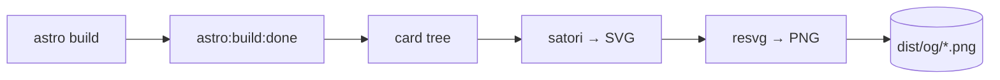

Share a link to most personal sites and the preview that pops up in LinkedIn or
WhatsApp is either blank or a stock favicon. It's a small thing, but it's the
first impression of the link — and on a site I'd just rebuilt, the default felt
like leaving the last button unbuttoned.

What I wanted: a branded card per post, showing that post's title, generated
automatically. What I didn't want: a separate image service, a headless browser
in the build, or anything that needed a server at request time. The site is
static and deployed on Cloudflare Pages — the cards should be plain files,
produced once at build.



## Why build time, not runtime

The tempting approach is generating the image on the fly with a Cloudflare
Function. I ruled it out for two reasons. First, the cards never change between
deploys — rendering them per request is wasted work and a cold-start tax on
something a social scraper hits once. Second, the obvious image libraries lean
on Node's `fs`/`path`, which the Cloudflare `workerd` prerender doesn't fully
provide — you fight the runtime instead of using it.

The pair that sidesteps all of it: **satori** turns a React-element-like tree
into SVG, and **resvg** rasterizes that SVG to PNG. Both are pure-Node, so they
run happily inside Astro's build hook with no browser and no runtime
dependency.

## The hook

Astro exposes an `astro:build:done` hook that fires after the static output is
written, with the output `dir` in hand. That's the moment to emit the images.
satori takes a tree of plain objects — no JSX needed — so the card is just a
small function describing the layout, themed to match the site:

```js
const el = (type, style, children) => ({ type, props: { style, children } })

const cardTree = (title, description) =>
  el("div", {
    width: 1200, height: 630, display: "flex", flexDirection: "column",
    justifyContent: "space-between", backgroundColor: "#0a0e16", color: "#f4f8fd",
    padding: "70px", borderLeft: "16px solid #38bdf8", fontFamily: "Onest",
  }, [
    el("div", { fontSize: 30, color: "#7d8ba1" }, "Daniel Márquez"),
    el("div", { display: "flex", flexDirection: "column" }, [
      el("div", { fontSize: 64, fontWeight: 700, lineHeight: 1.2 }, title),
      el("div", { fontSize: 30, color: "#aab6c7", marginTop: 24, lineHeight: 1.4 }, description),
    ]),
    el("div", { fontSize: 26, color: "#38bdf8" }, "danimarqz.dev"),
  ])
```

1200×630 is the size LinkedIn, X and the rest expect for a large summary card.
The left border and the accent colour are the only "brand" the card needs — the
title does the rest of the talking.

## Emitting one per post

The render step is small: tree → SVG → PNG → write to `dist/og/`.

```js
const ogCards = {
  name: "og-cards",
  hooks: {
    "astro:build:done": async ({ dir }) => {
      const { default: satori } = await import("satori")
      const { Resvg } = await import("@resvg/resvg-js")
      const fonts = await loadFonts()           // see "gotchas" below
      const outRoot = fileURLToPath(dir)

      const emit = async (route, title, description) => {
        const svg = await satori(cardTree(title, description), { width: 1200, height: 630, fonts })
        const png = new Resvg(svg).render().asPng()
        const out = join(outRoot, "og", `${route}.png`)
        mkdirSync(dirname(out), { recursive: true })
        writeFileSync(out, png)
      }

      await emit("site", "Daniel Márquez", "Backend & Cloud Engineer · Go · AWS · AI")
      for (const rel of readdirSync(BLOG_DIR, { recursive: true })) {
        if (!/\.mdx?$/.test(rel)) continue
        const { data } = matter(readFileSync(join(BLOG_DIR, rel), "utf8"))
        await emit(rel.replace(/\.mdx?$/, ""), data.title, data.description)
      }
    },
  },
}
```

A note on reading the frontmatter: it's tempting to grab the title with a quick
regex, and for fully controlled content it works — until a post title contains
a colon (this blog has a few) or a quoted value, and the card silently renders
half a title with no build error. Using a real parser like `gray-matter` —
already in Astro's dependency tree — costs nothing and removes a whole class of
"why is the card cut off" debugging.

## Gotchas worth knowing

A few things that bite quietly:

- **Fonts.** satori needs the font bytes. Fetching them from a CDN at build
  works, but it ties your build's success to that CDN being up. Vendoring the
  `.ttf` files into the repo makes the build hermetic — worth it for something
  that runs on every deploy.
- **Slug matching.** A recursive directory read returns nested paths
  (`my-post/en`), so the emitted PNG lives at `og/my-post/en.png`. The
  `og:image` meta tag for that page has to point at exactly that path — this is
  the most common place the whole thing silently breaks.
- **Absolute URLs.** `og:image` must be an absolute `https://` URL. Some
  scrapers won't resolve a relative one.
- **Caches.** LinkedIn, WhatsApp and friends cache previews aggressively. If you
  shared a link before the card existed, the old (or blank) preview sticks
  around — use the platform's post/sharing inspector to force a refresh.

## The lesson

The reflex for "generate an image per page" is to reach for a runtime: a
function, a service, a browser. But when the output is fixed at build, the build
*is* the runtime — and a hook plus two pure-Node libraries beats anything that
has to wake up per request. Push work to the earliest moment it can happen, and
the rest of the stack gets simpler.
