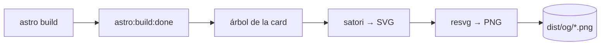

Comparte un enlace de casi cualquier web personal y la preview que aparece en
LinkedIn o WhatsApp está en blanco o muestra un favicon genérico. Es una cosa
pequeña, pero es la primera impresión del enlace — y en un sitio que acababa de
rehacer, el valor por defecto se sentía como dejar el último botón sin abrochar.

Lo que quería: una card de marca por post, mostrando el título de ese post,
generada automáticamente. Lo que no quería: un servicio de imágenes aparte, un
navegador headless en el build, ni nada que necesitara un servidor en el momento
de la petición. El sitio es estático y está en Cloudflare Pages — las cards
deberían ser ficheros planos, generados una sola vez en el build.



## Por qué en build, no en runtime

Lo tentador es generar la imagen al vuelo con una Cloudflare Function. Lo
descarté por dos motivos. Primero, las cards no cambian entre despliegues —
renderizarlas por petición es trabajo desperdiciado y un impuesto de cold-start
sobre algo que un scraper social toca una vez. Segundo, las librerías obvias de
imágenes dependen de `fs`/`path` de Node, que el prerender de `workerd` de
Cloudflare no provee del todo — acabas peleándote con el runtime en vez de
usarlo.

El dúo que esquiva todo eso: **satori** convierte un árbol tipo elemento-React
en SVG, y **resvg** rasteriza ese SVG a PNG. Ambos son pure-Node, así que corren
sin problema dentro del hook de build de Astro, sin navegador y sin dependencia
de runtime.

## El hook

Astro expone un hook `astro:build:done` que se dispara cuando la salida estática
ya está escrita, con el `dir` de salida en la mano. Ese es el momento de emitir
las imágenes. satori toma un árbol de objetos planos —sin JSX— así que la card
es solo una función pequeña que describe el layout, con el tema del sitio:

```js
const el = (type, style, children) => ({ type, props: { style, children } })

const cardTree = (title, description) =>
  el("div", {
    width: 1200, height: 630, display: "flex", flexDirection: "column",
    justifyContent: "space-between", backgroundColor: "#0a0e16", color: "#f4f8fd",
    padding: "70px", borderLeft: "16px solid #38bdf8", fontFamily: "Onest",
  }, [
    el("div", { fontSize: 30, color: "#7d8ba1" }, "Daniel Márquez"),
    el("div", { display: "flex", flexDirection: "column" }, [
      el("div", { fontSize: 64, fontWeight: 700, lineHeight: 1.2 }, title),
      el("div", { fontSize: 30, color: "#aab6c7", marginTop: 24, lineHeight: 1.4 }, description),
    ]),
    el("div", { fontSize: 26, color: "#38bdf8" }, "danimarqz.dev"),
  ])
```

1200×630 es el tamaño que LinkedIn, X y el resto esperan para una summary card
grande. El borde izquierdo y el color de acento son toda la "marca" que la card
necesita — el título hace el resto.

## Emitir una por post

El paso de render es pequeño: árbol → SVG → PNG → escribir en `dist/og/`.

```js
const ogCards = {
  name: "og-cards",
  hooks: {
    "astro:build:done": async ({ dir }) => {
      const { default: satori } = await import("satori")
      const { Resvg } = await import("@resvg/resvg-js")
      const fonts = await loadFonts()           // ver "trampas" más abajo
      const outRoot = fileURLToPath(dir)

      const emit = async (route, title, description) => {
        const svg = await satori(cardTree(title, description), { width: 1200, height: 630, fonts })
        const png = new Resvg(svg).render().asPng()
        const out = join(outRoot, "og", `${route}.png`)
        mkdirSync(dirname(out), { recursive: true })
        writeFileSync(out, png)
      }

      await emit("site", "Daniel Márquez", "Backend & Cloud Engineer · Go · AWS · IA")
      for (const rel of readdirSync(BLOG_DIR, { recursive: true })) {
        if (!/\.mdx?$/.test(rel)) continue
        const { data } = matter(readFileSync(join(BLOG_DIR, rel), "utf8"))
        await emit(rel.replace(/\.mdx?$/, ""), data.title, data.description)
      }
    },
  },
}
```

Una nota sobre leer el frontmatter: es tentador sacar el título con un regex
rápido, y para contenido totalmente controlado funciona — hasta que un título
lleva dos puntos (este blog tiene varios) o un valor entre comillas, y la card
renderiza medio título en silencio, sin error de build. Usar un parser de
verdad como `gray-matter` —que ya está en el árbol de dependencias de Astro— no
cuesta nada y elimina toda una clase de bugs del tipo "por qué sale la card
cortada".

## Trampas que conviene conocer

Algunas cosas que muerden en silencio:

- **Fuentes.** satori necesita los bytes de la fuente. Hacer fetch a un CDN en
  el build funciona, pero ata el éxito de tu build a que ese CDN esté arriba.
  Meter los `.ttf` en el repo hace el build hermético — merece la pena para algo
  que corre en cada despliegue.
- **Casar el slug.** Una lectura recursiva de directorio devuelve rutas anidadas
  (`mi-post/es`), así que el PNG emitido vive en `og/mi-post/es.png`. El meta tag
  `og:image` de esa página tiene que apuntar exactamente a esa ruta — es el sitio
  más común donde todo se rompe en silencio.
- **URLs absolutas.** `og:image` debe ser una URL `https://` absoluta. Algunos
  scrapers no resuelven una relativa.
- **Cachés.** LinkedIn, WhatsApp y compañía cachean las previews de forma
  agresiva. Si compartiste un enlace antes de que la card existiera, la preview
  vieja (o en blanco) se queda pegada — usa el inspector de la plataforma para
  forzar el refresco.

## La lección

El reflejo ante "generar una imagen por página" es tirar de un runtime: una
function, un servicio, un navegador. Pero cuando la salida está fijada en el
build, el build *es* el runtime — y un hook más dos librerías pure-Node le ganan
a cualquier cosa que tenga que despertarse en cada petición. Empuja el trabajo
al momento más temprano en que puede ocurrir, y el resto del stack se vuelve más
simple.
