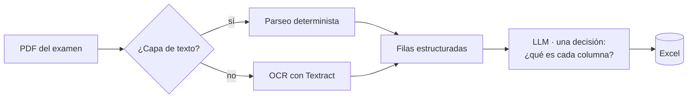

OpositaTCAE —una plataforma de preparación de oposiciones sanitarias— tenía una
tarea recurrente. En cada convocatoria, las administraciones publican las listas
de admisión en PDF, y cada comunidad las formatea distinto: unas son texto real,
otras son escaneos, y las columnas cambian de sitio de un documento a otro.
Convertir eso en una hoja de cálculo usable era manual, lento, y de esas cosas
que nadie quiere hacer dos veces.

La solución obvia —pasarle el PDF a un LLM y pedirle la tabla de vuelta— es
también la equivocada. Un LLM que lee el documento en crudo *y* transcribe los
valores *y* decide la estructura tiene tres sitios donde alucinar, y el que más
importa es el de los datos. Un número de DNI mal vale menos que no tener salida
ninguna.

Así que lo construí al revés. El LLM toma **exactamente una decisión**, y nunca
toca los datos.



## Determinismo primero, IA solo donde aporta

El pipeline lee el documento de forma determinista antes de involucrar a ningún
modelo. PyMuPDF comprueba si la página tiene de verdad una capa de texto
extraíble. Si la tiene, las filas se parsean directamente —sin modelo, sin
adivinar—. Si no, la página es un escaneo, y solo entonces pasa a Textract para
OCR. En ambos casos, lo que sale son **filas ya estructuradas con valores
reales**.

```python
text = page.get_text().strip()
if text:
    rows = parse_text_layout(page)     # determinista: los valores son exactos
else:
    rows = ocr_scanned_page(page)      # OCR como fallback, solo si hace falta

# el modelo nunca ve el PDF en crudo, solo muestras de columnas:
columns = classify_columns(header_samples)   # la única decisión
```

Cuando se llama al LLM, los datos ya están fijados. Al modelo se le pasan unos
pocos valores de muestra por columna y se le hace una sola pregunta: *¿qué
representa esta columna?* —nombre del aspirante, DNI, nota, estado—. Mapea
estructura a significado. No lee, no transcribe, no inventa ni un solo valor.

Ese es todo el truco. La salida varía en *formato* entre comunidades, pero el
LLM solo razona sobre el formato, nunca sobre el contenido. El resultado es
exportación automática a Excel con cero alucinaciones en los datos, porque los
datos nunca fueron tarea del modelo.

## El segundo agente: dos PDFs, un Excel cruzado

La misma filosofía mueve un segundo pipeline. Este toma dos documentos —un
cuadernillo de preguntas y su plantilla de respuestas— y produce un único Excel
más rico, listo para importar al banco de preguntas. Lo difícil no es leer
ninguno de los dos ficheros; es *emparejarlos* de forma fiable cuando su
numeración interna no siempre cuadra. De nuevo, el emparejado es determinista
donde puede serlo, y al modelo solo se le pide resolver estructura, no decidir a
ojo qué respuesta va con qué pregunta.

## Por qué este stack

Ambos corren en AWS Lambda (arm64 Graviton), con Bedrock para el modelo y
Textract para el OCR, desplegados con SAM. El serverless encaja perfecto con el
patrón de uso: este trabajo ocurre a ráfagas, alrededor de cada convocatoria, no
como tráfico constante —así que pagar por invocación gana a mantener nada
caliente—.

## La lección

El instinto con un modelo capaz es darle más responsabilidad. Lo contrario
escala mejor en producción: reduce la superficie de decisión del modelo a lo
mínimo que solo un modelo puede hacer, y deja que el código determinista sea
dueño de todo lo que se puede hacer exacto. El AWS Summit de este junio me
empujó hacia Bedrock y Graviton; el principio de diseño es más viejo que todo
eso. Determinismo primero. IA donde —y *solo* donde— se gana su sitio.
